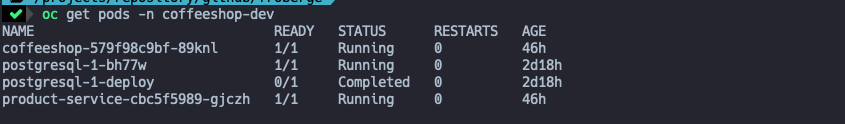
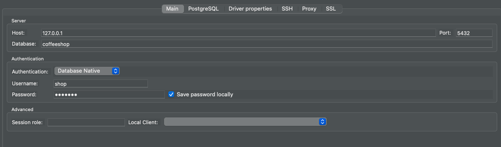

# Connect to a Database the run on OpenShift with favorite Database Tool

In this section we will demonstrate the steps needed to connect to a database the run on Openshift cluster with you favorite database tools on your machine.

## Prerequisites:

* Commanline access to the OpenShift cluster 
* Access to the projec on OpenShift that contains the Database
* Your favorite Database tools for.

For this tutorial we will be using [DBeaver a Free Universal Database Tool](https://dbeaver.io/) and we will be connecting to a [PostgreSQL](https://www.postgresql.org/) that run on a remote OpenShift Cluster.

In order to do this, we will use a port-forward mechanism. This mechanism could be use on any container running on OpenShift.
> oc port-forward <pod-name> <local-port>:<remote:port>

## Steps

1. Connect to your Openshift Cluster using the CLI

2. Retrieve the `Pod` that run the database.
> oc get pods -n <project-where-db-was-created>

or to only get the running pods
> oc get pods -n <project-where-db-was-created> --field-selector=status.phase=Running

ex:

3. Get the port expose for the service
> oc get svc postgresql -n <project-where-db-was-created>

ex:

We see here that the port is `5432`

4. With information gather on the step 2 and 3, make the port-forward.
> oc port-forward <POD_NAME> 5432:5432 -n <project-where-db-was-created>

ex:

:TADA: You can now connect your favorite Database tool using 127.0.0.0 as the host, 5432 as the port.

ex:

